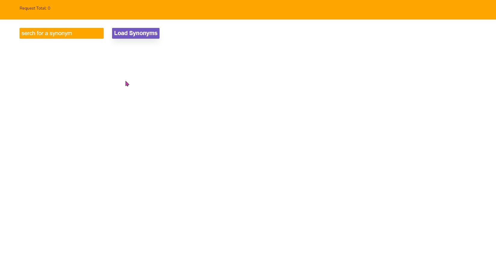

## REACT VITE APP - SYNONYM APP

To install the packeges: ``npm install``  
To run: ``npm run dev``

<h2>It's all responsive</h2>

## WHAT WAS USED
<ul>
<li>STYLED COMPONENTS</li>
<li>FETCH API</li>
<li>API <a href="https://www.datamuse.com/api/">Datamuse</a></li>
</ul>

## GIF and SCREENSHOTS

